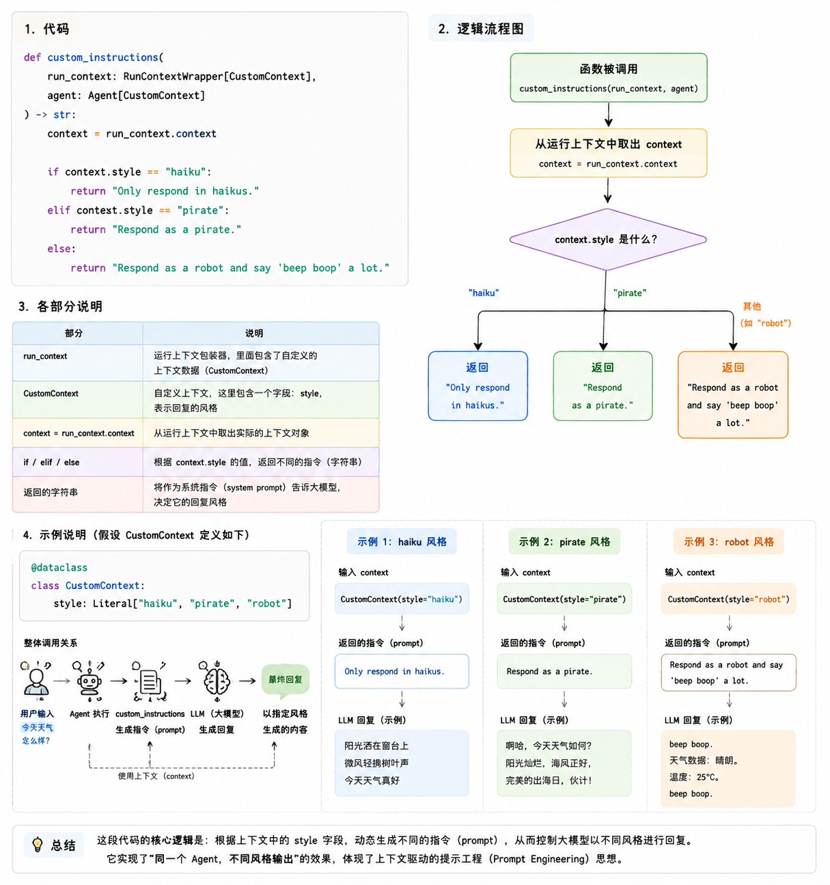
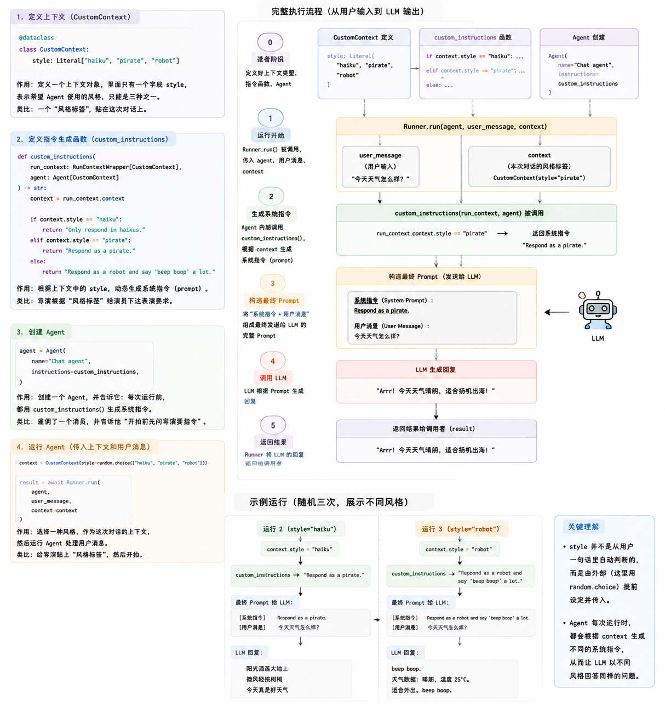
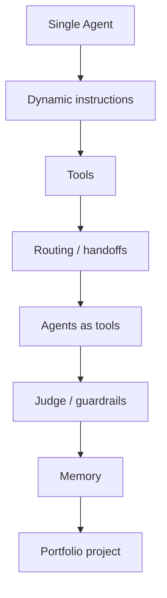

# Agent Learning Lab

> 我的 AI Agent 开发工程师学习日志：用代码、图解和复盘记录从 single agent 到 multi-agent system 的完整训练过程。

这个仓库不是单纯的 demo 集合，而是一个公开知识库。每个模块都会记录：

- 今天学了什么概念。
- 这个概念解决什么问题。
- 对应的最小可运行代码。
- 我的理解图、流程图和复盘。
- 后续如何升级成真实项目能力。

## Overall Progress

```text
Agent Engineer Roadmap
[##--------] 20%
```

| Phase | Topic | Status |
| --- | --- | --- |
| 01 | Single Agent basics | In progress |
| 02 | Tools and multi-turn tool use | Started |
| 03 | Agent patterns: routing, judge, guardrails | Started |
| 04 | Multi-agent collaboration and memory | Not started |
| 05 | Portfolio project | Not started |

## Today

今天学习的是：

**Single Agent: Dynamic Instructions / 双人格 Agent**

它也可以叫：

- dynamic system prompt
- context-driven instructions
- single agent with multiple personas

核心理解：

> 同一个 Agent 不一定只有一种固定人格。它可以在每次运行前，根据 context 动态生成 instructions，从而用不同策略回答同一个用户问题。

## Current Module

| Item | Path |
| --- | --- |
| Note | [`notes/01_dynamic_instructions.md`](notes/01_dynamic_instructions.md) |
| Code | [`src/01_single_agent/dual_persona_agent.py`](src/01_single_agent/dual_persona_agent.py) |
| Diagram 1 | [`assets/01-dynamic-instructions/code-and-flow.png`](assets/01-dynamic-instructions/code-and-flow.png) |
| Diagram 2 | [`assets/01-dynamic-instructions/full-execution-flow.png`](assets/01-dynamic-instructions/full-execution-flow.png) |

### Visual Notes





### Run The Code

```bash
pip install -r requirements.txt
export DEEPSEEK_API_KEY="your_key"
python src/01_single_agent/dual_persona_agent.py
```

Preview the dynamic instructions without an API key:

```bash
python src/01_single_agent/dual_persona_agent.py --dry-run
```

## Learning Map



## Repository Structure

```text
assets/                 Images and diagrams
notes/                  Learning notes and reflections
src/                    Runnable practice code
```

## How I Judge Whether I Learned It

For each module, I need to be able to answer:

1. What problem does this pattern solve?
2. What are the key SDK objects?
3. What is the execution flow?
4. Can I modify the example into my own scenario?
5. Can I explain it without looking at the code?
